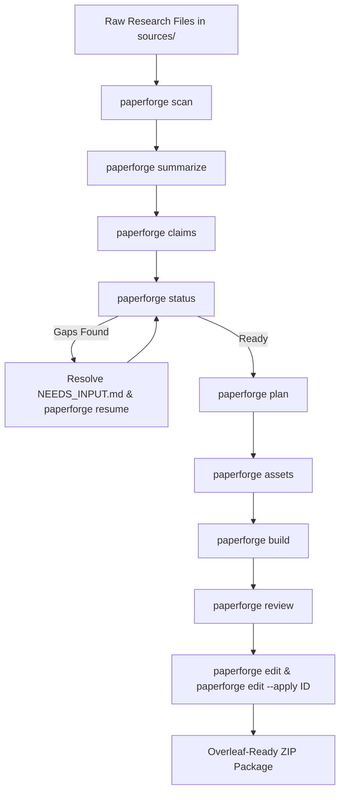

# PaperForge

> **Local-First, CLI-Only Agentic Research-Repository Tool**
> 
> *Ingests raw research artifacts (`sources/`) and produces a self-contained, Overleaf-ready IEEE conference LaTeX manuscript grounded entirely in traceable evidence.*

---

## 📋 Table of Contents
1. [Overview & Core Philosophy](#-overview--core-philosophy)
2. [Key Capabilities](#-key-capabilities)
3. [Prerequisites & System Requirements](#-prerequisites--system-requirements)
4. [Installation & Setup](#-installation--setup)
5. [Environment Variables (`.env`)](#-environment-variables-env)
6. [Configuration (`config.yaml`)](#-configuration-configyaml)
7. [Pluggable LLM & Embedding Providers](#-pluggable-llm--embedding-providers)
   - [Local Zero-Cost Mode (Default)](#1-local-zero-cost-mode-default)
   - [Cloud API Modes (Free-Tier / Production)](#2-cloud-api-modes-free-tier--production)
8. [Project Repository Layout](#-project-repository-layout)
9. [Step-by-Step End-to-End Workflow](#-step-by-step-end-to-end-workflow)
10. [Exhaustive CLI Command Reference](#-exhaustive-cli-command-reference)
11. [Data Traceability & Staleness Propagation](#-data-traceability--staleness-propagation)
12. [Overleaf Manuscript Package & TeX Compilation](#-overleaf-manuscript-package--tex-compilation)
13. [Troubleshooting & FAQ](#-troubleshooting--faq)
14. [License](#-license)

---

## 🔬 Overview & Core Philosophy

**PaperForge** bridges the gap between raw research repositories (datasets, Python scripts, Markdown notes, PDFs, experimental CSV results) and publication-ready academic papers. 

Unlike generic AI writing assistants that invent ungrounded claims or hallucinate metrics, PaperForge adheres to strict scientific grounding principles:
- **Zero-Hallucination & Traceable Provenance**: Every quantitative claim in the generated manuscript is linked directly to an exact source file, line range, CSV row, or code AST symbol stored in a local SQLite database (`.paperforge/paperforge.db`).
- **100% Local & Cost-Free Execution**: Built using embedded SQLite, Chroma vector store, local SentenceTransformer embeddings (`bge-small-en-v1.5`), and local LLM execution via Ollama (`llama3.2`). No mandatory cloud subscriptions.
- **Strict IEEEtran Template Conformance**: Manuscripts strictly fork the official IEEE conference LaTeX template (`assets/ieee_conference_template.tex`), preserving standard packages, macro definitions, and author blocks while stripping generic placeholder prose.
- **Incremental Scanning & Downstream Staleness Propagation**: When a source file changes in `sources/`, SHA-256 content hashing marks all dependent evidence records, claims, figures, and tables as `STALE`, prompting re-verification.
- **Interactive Revision Layer with Git Versioning**: Propose edits with diff previews, automatically block unsupported claims, apply confirmed edits, and track all changes via Git commits inside `paper/`.

---

## ⚡ Key Capabilities

- **Multimodal Static Parsers**: Extract structured text and tabular data from PDF (PyMuPDF), Markdown, CSV/XLSX (Pandas), Python AST code models, and plain text.
- **Hybrid RAG Retrieval**: Combines dense vector search (ChromaDB + SentenceTransformers) and sparse keyword retrieval (BM25Okapi) using Reciprocal Rank Fusion (RRF).
- **Human-in-the-Loop Gap Agent**: Classifies missing information into Resolution Tiers A–E and generates a structured `NEEDS_INPUT.md` checklist when blocking gaps exist.
- **Automated Publication Asset Generation**:
  - Matplotlib data-driven vector figures (`figures/*.pdf`).
  - Native TikZ architecture diagrams (`figures/*.tikz.tex`).
  - Publication-grade `booktabs` LaTeX tables (`tables/*.tex`).
  - BibTeX citation retrieval (`references.bib`).
- **Skeptical Peer Review Audit**: Runs an automated IEEE reviewer pass (`paperforge review`) that evaluates novelty support, metric consistency, leakage risks, and formatting compliance.

---

## 🛠️ Prerequisites & System Requirements

- **Operating System**: Linux, macOS, or Windows WSL2.
- **Python**: Version `3.10` or higher (`3.11` / `3.12` recommended).
- **Git**: Installed and configured on local `PATH`.
- **LaTeX Compiler** *(Optional but recommended)*:
  - [Tectonic](https://tectonic-typesetting.github.io/) or `pdflatex` / `latexmk` for local compilation verification.
  - *Note: If a local TeX engine is absent, PaperForge performs complete static reference/citation validation and outputs an Overleaf-ready ZIP bundle.*
- **Ollama** *(Optional for local zero-cost LLM execution)*:
  - Download from [ollama.com](https://ollama.com) and pull the default model: `ollama pull llama3.2`.

---

## 🚀 Installation & Setup

### 1. Clone the Repository
```bash
git clone https://github.com/your-username/PaperForge.git
cd PaperForge
```

### 2. Create and Activate a Python Virtual Environment
```bash
python3 -m venv .venv
source .venv/bin/activate
```

### 3. Install Package in Editable Mode
```bash
pip install --upgrade pip
pip install -e .
```

### 4. Verify Installation
```bash
paperforge --help
```

---

## 🔑 Environment Variables (`.env`)

PaperForge loads environment variables from a `.env` file located at the root of your project directory. Copy `.env.example` to create your initial `.env`:

```bash
cp .env.example .env
```

### Complete `.env` Variable Specification:

```env
# ==============================================================================
# PaperForge System Environment Configuration
# ==============================================================================

# ------------------------------------------------------------------------------
# LLM Provider Configuration
# Supported Options: ollama (default), gemini, groq, openrouter, anthropic, openai
# ------------------------------------------------------------------------------
PAPERFORGE_LLM_PROVIDER=ollama
PAPERFORGE_LLM_MODEL=llama3.2

# Local Ollama Host Endpoint (Default local zero-cost)
OLLAMA_HOST=http://localhost:11434

# ------------------------------------------------------------------------------
# Cloud LLM API Keys (Optional — set if using a cloud provider)
# ------------------------------------------------------------------------------
GEMINI_API_KEY=your_gemini_api_key_here
GROQ_API_KEY=your_groq_api_key_here
OPENROUTER_API_KEY=your_openrouter_api_key_here
ANTHROPIC_API_KEY=your_anthropic_api_key_here
OPENAI_API_KEY=your_openai_api_key_here

# ------------------------------------------------------------------------------
# Embedding Provider Configuration
# Supported Options: local (BAAI/bge-small-en-v1.5)
# ------------------------------------------------------------------------------
PAPERFORGE_EMBEDDING_PROVIDER=local
PAPERFORGE_EMBEDDING_MODEL=BAAI/bge-small-en-v1.5

# ------------------------------------------------------------------------------
# Database & Workspace Storage Paths
# ------------------------------------------------------------------------------
PAPERFORGE_DB_PATH=.paperforge/paperforge.db
PAPERFORGE_SOURCES_DIR=sources
PAPERFORGE_PAPER_DIR=paper
PAPERFORGE_ASSETS_DIR=assets
```

---

## ⚙️ Configuration (`config.yaml`)

Each PaperForge research repository contains a `config.yaml` file that specifies project settings. Running `paperforge init` automatically creates a default `config.yaml`:

```yaml
llm:
  provider: ollama       # Options: ollama, gemini, groq, openrouter, anthropic, openai
  host: http://localhost:11434
  model: llama3.2

embeddings:
  provider: local        # Local SentenceTransformer embeddings
  model: BAAI/bge-small-en-v1.5

paths:
  sources_dir: sources
  paper_dir: paper
  assets_dir: assets
  db_path: .paperforge/paperforge.db
```

---

## 🔌 Pluggable LLM & Embedding Providers

PaperForge is designed with a pluggable provider abstraction (`paperforge/providers/`). You can run fully local or connect to free-tier cloud APIs without changing your project code.

### 1. Local Zero-Cost Mode (Default)
Run completely offline with zero API fees using Ollama and local HuggingFace embeddings:
1. Install Ollama and pull the model:
   ```bash
   ollama pull llama3.2
   ```
2. Set `config.yaml`:
   ```yaml
   llm:
     provider: ollama
     host: http://localhost:11434
     model: llama3.2
   embeddings:
     provider: local
     model: BAAI/bge-small-en-v1.5
   ```
3. Run diagnostic check:
   ```bash
   paperforge doctor
   ```

### 2. Cloud API Modes (Free-Tier / Production)
To switch to a cloud LLM provider, set the corresponding API key in `.env` (or shell environment) and update `config.yaml`:

#### Google Gemini (Free Tier Supported)
```bash
export GEMINI_API_KEY="AIzaSy..."
```
`config.yaml`:
```yaml
llm:
  provider: gemini
  model: gemini-1.5-flash
```

#### Groq (Ultra-Fast Free Tier)
```bash
export GROQ_API_KEY="gsk_..."
```
`config.yaml`:
```yaml
llm:
  provider: groq
  model: llama-3.3-70b-versatile
```

#### OpenRouter / Anthropic / OpenAI
Set `OPENROUTER_API_KEY`, `ANTHROPIC_API_KEY`, or `OPENAI_API_KEY` in `.env` and set `llm.provider` in `config.yaml`.

---

## 📁 Project Repository Layout

When initialized via `paperforge init`, your research repository adopts the following authoritative structure:

```
my_research_project/
├── .env                       # Environment variables and API keys
├── config.yaml                # Project configuration settings
├── README.md                  # User documentation
├── TRACKER.md                 # Verbatim system audit log & decision tracker
├── NEEDS_INPUT.md             # (Generated) Blocking evidence gaps & action items
├── review_report.md           # (Generated) Skeptical peer review audit report
├── paper_20260905_120026.zip  # (Generated) Overleaf-ready compressed ZIP bundle
├── sources/                   # Input research files (PDF, CSV, MD, PY, etc.)
│   ├── experiment_results.csv
│   ├── architecture_notes.md
│   └── model_pipeline.py
├── .paperforge/               # Internal state & database (Git-ignored)
│   ├── paperforge.db          # SQLite relational database (15 ORM tables)
│   └── chroma_db/             # Chroma vector storage directory
├── assets/                    # Ground truth templates
│   └── ieee_conference_template.tex
└── paper/                     # Generated IEEE LaTeX manuscript repository
    ├── .git/                  # Git repository tracking manuscript history
    ├── main.tex               # Primary IEEEtran manuscript document
    ├── references.bib         # BibTeX literature citations
    ├── build.log              # TeX compilation log
    ├── sections/              # Modular section LaTeX fragments
    │   ├── 01_introduction.tex
    │   ├── 02_related_work.tex
    │   ├── 03_system_architecture.tex
    │   ├── 04_experimental_setup.tex
    │   ├── 05_evaluation.tex
    │   └── 06_conclusion.tex
    ├── figures/               # Vector graphics & TikZ diagrams
    │   ├── accuracy_chart.pdf
    │   └── architecture.tikz.tex
    └── tables/                # LaTeX booktabs tables
        └── evaluation_metrics.tex
```

---

## 🔄 Step-by-Step End-to-End Workflow

Follow this complete step-by-step workflow to generate an Overleaf-ready IEEE manuscript from raw research files:



### Step 1: Initialize Project Directory
Create a new directory for your paper and initialize PaperForge:
```bash
mkdir my_paper && cd my_paper
paperforge init
```

### Step 2: Diagnostic Doctor Check
Verify that local DB, LLM provider, and embedding engines are operational:
```bash
paperforge doctor
```

### Step 3: Populate `sources/` Directory
Copy your raw research files (PDF papers, CSV benchmark results, Markdown research notes, Python model code) into the `sources/` folder:
```bash
cp /path/to/results.csv sources/
cp /path/to/notes.md sources/
cp /path/to/model.py sources/
```

### Step 4: Incremental Scan & Grounded Retrieval
Scan the `sources/` directory to index all evidence chunks into SQLite and ChromaDB:
```bash
paperforge scan
```
Query your ingested evidence using grounded RAG search:
```bash
paperforge ask "What is the peak accuracy achieved by Transformer-Fusion?"
```

### Step 5: Research Understanding & Evidence Extraction
Extract research entities (`Dataset`, `Model`, `Result`, `AuthorInfo`) and candidate quantitative claims:
```bash
paperforge summarize
paperforge claims
paperforge contradictions
```

### Step 6: Gap Analysis & Resolution
Check current project readiness and blocking gaps:
```bash
paperforge status
```
*If blocking gaps exist, open `NEEDS_INPUT.md`, add required files to `sources/`, and run:*
```bash
paperforge resume
```

### Step 7: Section Planning & Asset Generation
Plan section claim allocations and build vector figures, TikZ diagrams, LaTeX tables, and BibTeX citations:
```bash
paperforge plan
paperforge assets
```

### Step 8: Assemble Manuscript & Compile Overleaf ZIP
Fork the ground truth IEEE template, validate citations, compile with TeX, initialize Git inside `paper/`, and produce an Overleaf-ready ZIP package:
```bash
paperforge build
```

### Step 9: Skeptical IEEE Peer Review Audit
Run an automated peer review pass to check claim grounding, metric consistency, and formatting compliance:
```bash
paperforge review
```

### Step 10: Interactive Manuscript Revision
Inspect sections with line numbers and markers:
```bash
paperforge show introduction
```
Propose an edit (unsupported claims will be automatically **BLOCKED**):
```bash
paperforge edit "We extend PaperForge with local vector caching." --target introduction
```
Apply the proposed edit and commit to Git:
```bash
paperforge edit --apply 1
```
View manuscript commit history:
```bash
paperforge history
```

---

## 📖 Exhaustive CLI Command Reference

| Command | Usage Syntax | Parameters / Options | Description |
| :--- | :--- | :--- | :--- |
| **`init`** | `paperforge init [DIR]` | `DIR` (Optional, default `.`) | Initializes directory structure (`sources/`, `.paperforge/`, `assets/`, `config.yaml`, `.env.example`, `README.md`). |
| **`doctor`** | `paperforge doctor` | `--config-path` (Default `config.yaml`) | Checks system health, LLM connectivity, local embedding model status, and SQLite database setup. |
| **`scan`** | `paperforge scan` | `--config-path` (Default `config.yaml`) | Incrementally scans `sources/`, computes SHA-256 hashes, indexes chunks, and propagates `STALE` status to modified evidence. |
| **`ask`** | `paperforge ask "QUERY"` | `QUERY` (Required text string) | Performs hybrid RAG search (Chroma + BM25 + RRF) and returns an answer grounded in exact evidence locations. |
| **`summarize`** | `paperforge summarize` | `--config-path` (Default `config.yaml`) | Extracts structured research entities (`Model`, `Dataset`, `Result`, `AuthorInfo`) from fresh evidence. |
| **`claims`** | `paperforge claims` | `--config-path` (Default `config.yaml`) | Extracts quantitative claims, links evidence IDs, sets status to `VERIFIED`, `PARTIAL`, or `UNSUPPORTED`. |
| **`contradictions`**| `paperforge contradictions` | `--config-path` (Default `config.yaml`) | Displays conflicting evidence records for human clarification. |
| **`status`** | `paperforge status` | `--config-path` (Default `config.yaml`) | Summarizes verified claims, stale items, blocking gaps, and reports if repository is ready for paper planning. |
| **`resume`** | `paperforge resume` | `--config-path` (Default `config.yaml`) | Rescans `sources/`, re-evaluates gap analysis, and updates `NEEDS_INPUT.md`. |
| **`plan`** | `paperforge plan` | `--config-path` (Default `config.yaml`) | Maps verified claims to standard IEEE sections and plans figure/table asset requirements. |
| **`assets`** | `paperforge assets` | `--config-path` (Default `config.yaml`) | Generates Matplotlib vector PDF charts, native TikZ architecture diagrams, `booktabs` tables, and `references.bib`. |
| **`build`** | `paperforge build` | `--apply-review` (Flag to auto-fix review notes) | Strips generic prose from IEEE template, assembles `sections/*.tex`, validates refs/cites, compiles TeX, and zips Overleaf bundle. |
| **`review`** | `paperforge review` | `--config-path` (Default `config.yaml`) | Runs a skeptical IEEE peer review audit and generates `review_report.md`. |
| **`show`** | `paperforge show TARGET` | `TARGET` (e.g. `introduction`, `01_introduction.tex`) | Displays section content with line numbers and inline markers. |
| **`edit`** | `paperforge edit "PROMPT"` | `--target`, `--apply ID`, `--allow-unsupported` | Proposes or applies manuscript revisions. Blocks unsupported claims unless `--allow-unsupported` is passed. |
| **`history`** | `paperforge history` | `--config-path` (Default `config.yaml`) | Displays Git commit log inside the generated `paper/` directory. |
| **`revert`** | `paperforge revert HASH` | `HASH` (Required Git commit hash) | Reverts a specific Git commit in the `paper/` manuscript repository. |

---

## 📊 Data Traceability & Staleness Propagation

PaperForge enforces complete scientific lineage across 15 relational database tables in SQLite (`.paperforge/paperforge.db`):

```
Source (sources/file.csv) ──[SHA256 Hash]──> Evidence (Chunk / Row)
                                                  │
                       ┌──────────────────────────┼──────────────────────────┐
                       ▼                          ▼                          ▼
                 Claim (#1)                 Figure (#1)                Table (#1)
         (Status: VERIFIED/STALE)    (Vector PDF / TikZ)         (LaTeX booktabs)
                       │                          │                          │
                       └──────────────────────────┼──────────────────────────┘
                                                  ▼
                                       IEEE Manuscript Section
                                       (sections/05_evaluation.tex)
```

### Staleness Propagation Rule:
When any source file in `sources/` is edited or replaced:
1. `paperforge scan` re-calculates the file's SHA-256 hash.
2. All `Evidence` records tied to the previous content hash are immediately marked as `STALE`.
3. Downstream `Claim`, `Figure`, and `Table` records referencing those evidence IDs inherit the `STALE` status.
4. `paperforge status` flags these stale items, requiring re-verification before compiling a final paper draft.

---

## 📦 Overleaf Manuscript Package & TeX Compilation

Running `paperforge build` generates a self-contained, Overleaf-ready manuscript inside the `paper/` directory and compresses it into a ZIP archive (`paper_<timestamp>.zip`).

### Key Packaging Features:
- **Clean IEEEtran Fork**: Inherits document class `\documentclass[conference]{IEEEtran}` and standard packages (`cite`, `amsmath`, `amssymb`, `amsfonts`, `algorithmic`, `graphicx`, `textcomp`, `xcolor`, `booktabs`, `tikz`). All instructional placeholder prose from the template is completely stripped.
- **Modular Section Ingestion**: Main document (`main.tex`) uses clean `\input{sections/01_introduction.tex}` statements for maintainability.
- **Reference & Citation Validation**: Before invoking TeX, PaperForge scans all `\ref{}` and `\cite{}` keys against generated labels and BibTeX entries in `references.bib`, preventing compilation errors.
- **Overleaf Import Ready**: Simply upload `paper_<timestamp>.zip` directly to [Overleaf](https://www.overleaf.com) and click **Compile** to render your publication PDF.

---

## ❓ Troubleshooting & FAQ

### Q1: `paperforge doctor` shows `LLM Provider: FAILED`.
- **Cause**: Ollama service is not running locally, or configured cloud API key is missing.
- **Fix**:
  - For local Ollama: Ensure Ollama is running (`ollama serve`) and the model is pulled (`ollama pull llama3.2`).
  - For cloud providers: Ensure your API key is set in `.env` (e.g. `GEMINI_API_KEY="AIzaSy..."`).

### Q2: Tectonic compiler is not found during `paperforge build`.
- **Behavior**: PaperForge automatically falls back to static reference validation and outputs a clean Overleaf-ready `paper_<timestamp>.zip` bundle.
- **Fix (Optional)**: Install Tectonic locally via `cargo install tectonic` or package manager (`sudo apt install tectonic` / `brew install tectonic`).

### Q3: `paperforge edit` says `Edit Blocked: Instruction contains an unsupported claim`.
- **Cause**: Principle 11 strictly prohibits introducing quantitative claims that lack grounded evidence in `sources/`.
- **Fix**: Add the missing data file or experiment log to `sources/` and run `paperforge scan`. Alternatively, if you wish to override this safety guardrail, pass the `--allow-unsupported` flag:
  ```bash
  paperforge edit "My unsupported claim text" --allow-unsupported
  ```

### Q4: How do I track state changes and agent decisions?
- **Answer**: Inspect `TRACKER.md` in your project root. PaperForge logs every command execution, summary, reasoning, and file modification verbatim with UTC timestamps.

---

## 📄 License

PaperForge is released under the **MIT License**. See `LICENSE` for details.
